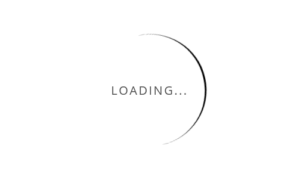

# :rocket: Desafio 30 dias de CSS :rocket:

O objetivo desse desafio é desenvolver as minhas habilidades em CSS e HTML.

Idealizadora do desafio: [Milena Carecho](https://github.com/MilenaCarecho).

### Index

- [x] [Dia 01 - Ícone de mídia social em camadas](#day01)
- [x] [Dia 02 - Loader animado](#day02)
- [x] [Dia 03 - Mudança de cor de texto quando entra em outra div](#day03)
- [x] [Dia 04 - Botão com efeito](#day04)
- [x] [Dia 05 - Efeito pulsar](#day05)
- [x] [Dia 06 - Efeito lightning text](#day06)
- [x] [Dia 07 - Preloader animado](#day07)  
- [x] [Dia 08 - Coração batendo](#day08)
- [ ] [Dia 09 - Pendulo de Newton](#day09)
- [ ] [Dia 10 - Animação texto alternando](#day10)
- [ ] [Dia 11 - Botão com efeito hover](#day11)
- [ ] [Dia 12 - Efeito de preenchimento ao passar o mouse](#day12)
- [ ] [Dia 13 - Loading com efeito](#day13)
- [ ] [Dia 14 - Fundo de texto animado](#day14)
- [ ] [Dia 15 - Texto flutuante](#day15)
- [ ] [Dia 16 - Botão com efeito](#day16)
- [ ] [Dia 17 - Loader animado](#day17)
- [ ] [Dia 18 - Texto esfumaçado](#day18)
- [ ] [Dia 19 - Efeitos de animação de fundo de partículas](#day19)
- [ ] [Dia 20 - Botão com efeito](#day20)
- [ ] [Dia 21 - Esferas quicando](#day21)
- [ ] [Dia 22 - Icones com efeito](#day22)
- [ ] [Dia 23 - Botão com efeito hover](#day23)
- [ ] [Dia 24 - Preloader animado](#day24)
- [ ] [Dia 25 - Checkbox animado](#day25)
- [ ] [Dia 26 - Loading com efeito](#day26)
- [ ] [Dia 27 - Efeito pulsar](#day27)
- [ ] [Dia 28 - Cor do background mudando](#day28)
- [ ] [Dia 29 - Menu responsivo com Media Queries](#day29)
- [ ] [Dia 30 - Fogos de artificio](#day30)

### Dia 01 - Ícone de mídia social em camadas 

### Dia 02 - Loader animado 

### Dia 03 - Mudança de cor de texto quando entra em outra div 

### Dia 04 - Botão com efeito 

### Dia 05 - Efeito pulsar 

### Dia 06 - Efeito lightning text 

### Dia 07 - Preloader animado 

### Dia 08 - Coração batendo 

